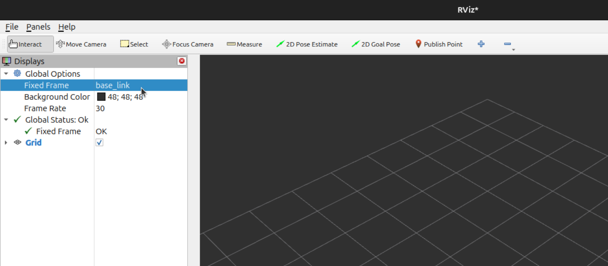
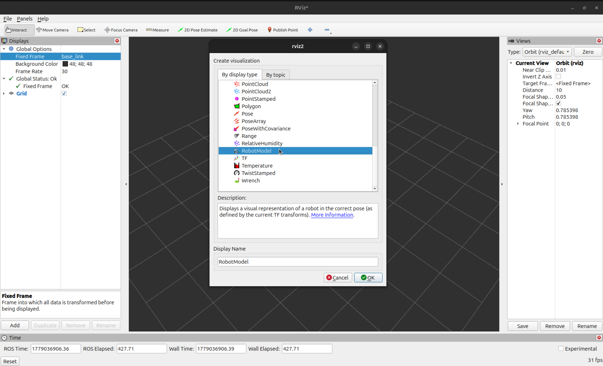
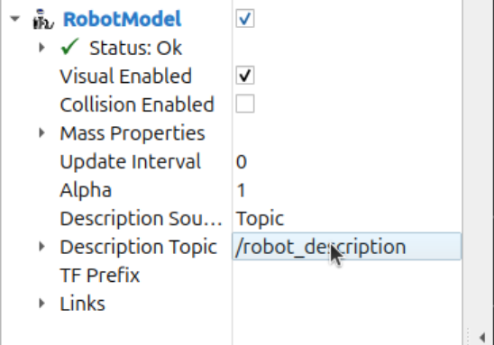
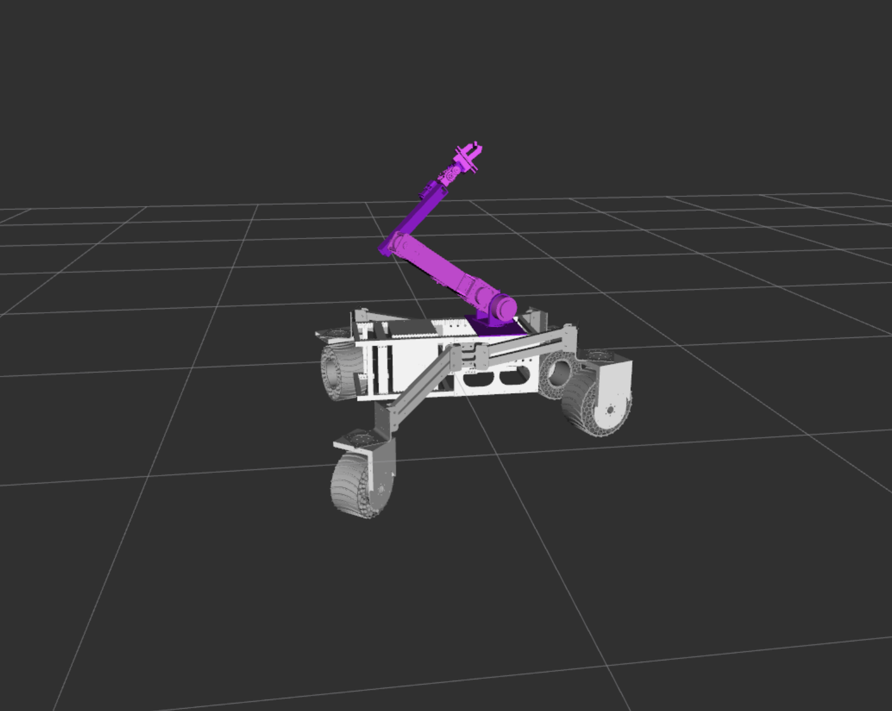

# proxima_common


How to see simulation ( for now rviz2 only - gazebo needs inertia )

```
colcon build --packages-select proxima_description
source install/setup.bash # or .zsh
```
with that you can run proxima with an arm:
```
ros2 launch proxima_description display.launch.py manipulator:=6DOF
```
or without:
```
ros2 launch proxima_description display.launch.py
```
Now that rviz is running, change `Fixed Frame` to `base_link` in the top right corner:

next click `Add` from the bottom left corner, select `RobotModel` and click `OK`:

In the `Displays` a new `RobotModel` section shoud appear, expand it and change `Description Topic` to `/robot_description`

After you click somewhere else on the screen, rvis will update the visualization and display proxima. you can change joint states with `Joint State Publisher` that appeared in another window. Enjoy!!

### Topics
List of all joints in proxima:
- rod_front_right_upper_joint
- fork_front_right_joint
- wheel_front_right_joint
- rod_front_left_upper_joint
- fork_front_left_joint
- wheel_front_left_joint
- rod_rear_right_upper_joint
- fork_rear_right_joint
- wheel_rear_right_joint
- rod_rear_left_upper_joint
- fork_rear_left_joint
- wheel_rear_left_joint


List of all joint to controll arm:
- joint_1
- joint_2
- joint_3
- joint_4
- joint_5
- joint_6
